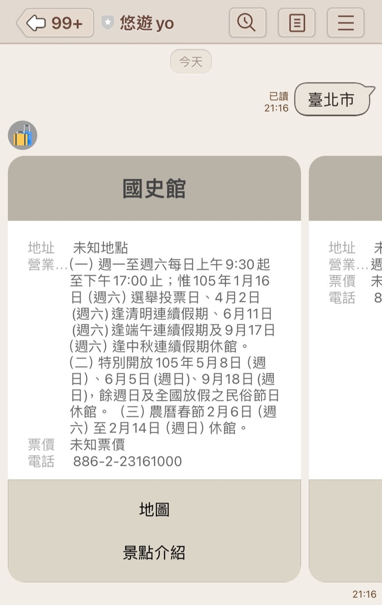

# 悠遊yo 
## Linebot 景點查詢機器人

假日天氣好卻不知道要去哪裡玩

別擔心~我會提供你幾個好玩或距離較近的旅遊景點~

輸入以下 ID 即可加入 Line 好友~

## ID : @103qcjry

---

## 使用方式

**【輸入縣市】**

1. 輸入完整縣市名

2. 每次使用單詞查詢，例如:臺北市、新北市、宜蘭縣、苗栗縣、臺南市...

▼ 注意 : 縣市名 "臺" 不可寫成 "台"，不可將 "臺北市" 縮寫為 "臺北"

**【輸入區域】**

1. 輸入"北部"、"西部"、"東部"、"南部" 或 "離島"

2. 點選快速回覆選項

**【位置分享】**

1. 於聊天室內使用line定位功能

2. 選擇欲前往之位置並分享定位

---
## 使用範例
一、【輸入縣市】畫面

1. 輸入縣市名

2. 可獲得該縣市隨機10個景點資訊

二、【輸入區域】畫面

1. 輸入區域

2. 點選快速回覆之縣市選項

3. 可獲得該縣市隨機10個景點資訊

三、【位置分享】畫面

1. 分享位置訊息

2. 可獲得距離最近的10個景點資訊

---

## 公開資料來源

政府資料開放平台 【景點 - 觀光資訊資料庫】

https://data.gov.tw/dataset/7777

JSON檔案

https://media.taiwan.net.tw/XMLReleaseALL_public/scenic_spot_C_f.json

## 作業連結
- [儲存庫](https://github.com/shuyu626/hw_linebot.git)
